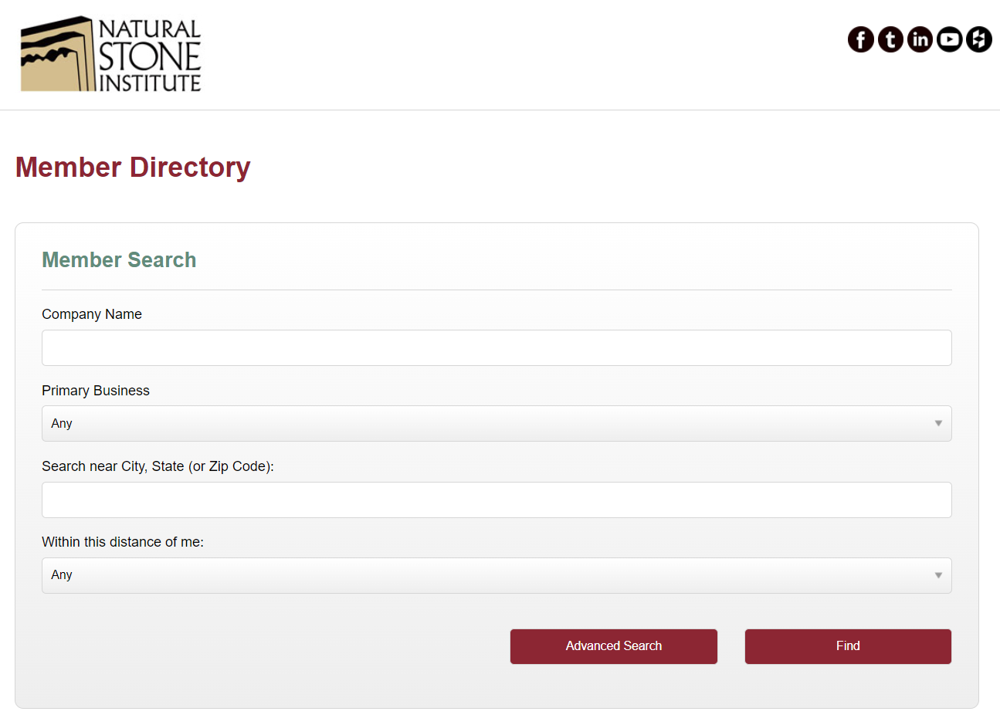
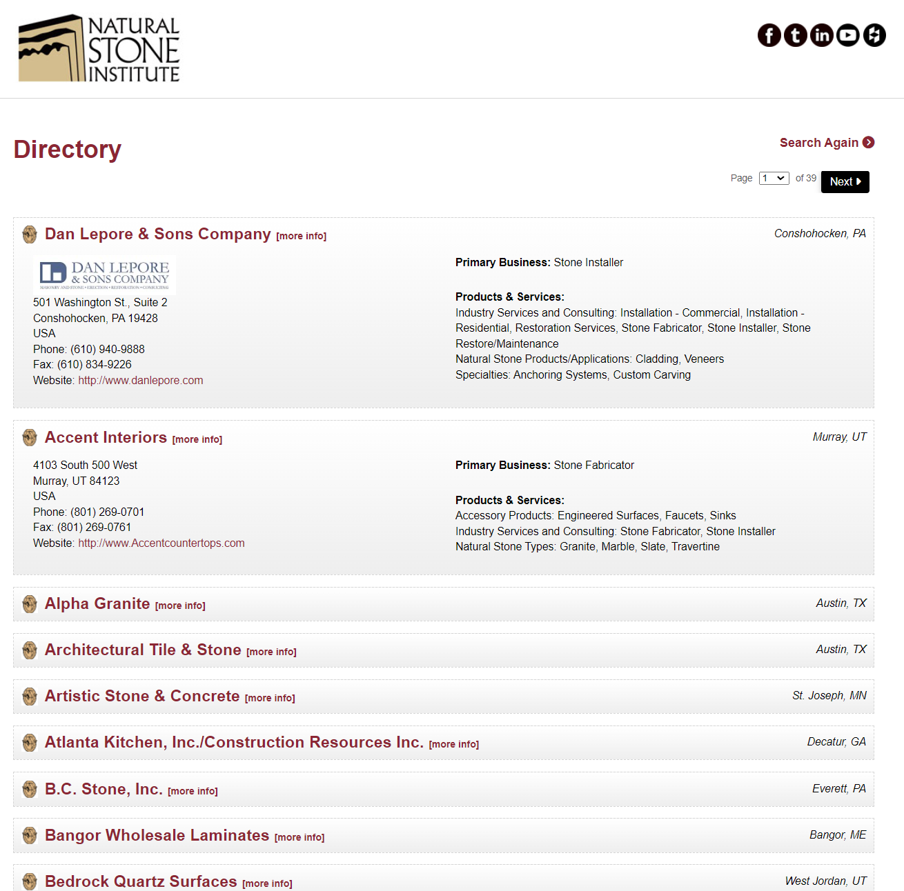
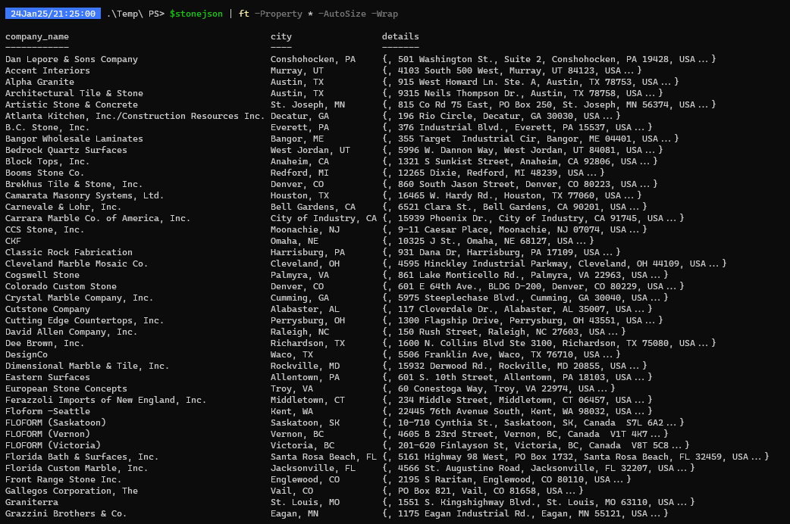

# Background Info

Someone from a discord chat asked if someone can get information from a website with a public directory

## Get the data from the website

```powershell
$r1 = Invoke-WebRequest -Uri "https://associationdatabase.com/aws/MIA/pt/sp/public_members_directory" -Method Get

# Extract the action URL for the form
$formAction = $r1.Forms[0].Action

# If the form action is a relative path, concatenate with the base URI
if (-not [Uri]::IsWellFormedUriString($formAction, [UriKind]::Absolute)) {
    write-host "Relative path detected"
    $formAction = [Uri]::new($r1.BaseResponse.ResponseUri, $formAction).AbsoluteUri
} else {
    write-host "Absolute path detected"
}

# POST request with the form data
$response = Invoke-WebRequest -Uri $formAction -Method Post -Body $formFields -WebSession $r1.Session

# The resulting HTML is stored in $response
$directoryhtml = $response.Content

# Export to html file
$directoryhtml | Out-File -FilePath "C:\temp\directory.html"

```

Example: 
[Example HTML file](Extras/stone_page1.html)
## Parse through html file

```python
from bs4 import BeautifulSoup
import json

# Function to extract data from a single 'tcsDirectory' div
def extract_tcs_directory_data(div):
    datasets = []

    # Iterating through each 'directory_listing' in the 'tcsDirectory' div
    for listing in div.find_all('div', class_='directory_listing'):
        data = {}

        # Extracting the company name and city
        title_div = listing.find('div', class_='directory_title')
        if title_div:
            data['company_name'] = title_div.get_text(strip=True).split("[")[0].strip()
            city_span = title_div.find('span', class_='directory_title_city')
            if city_span:
                data['city'] = city_span.get_text(strip=True)

        # Extracting other details from 'directory_info'
        info_div = listing.find('div', class_='directory_info')
        if info_div:
            values = info_div.find_all('span', class_='directory-value')
            details = [value.get_text(strip=True) for value in values]
            data['details'] = details

        datasets.append(data)

    return datasets

# Read the HTML file
file_path = 'C:\\Temp\\directory.html"'  # Replace with the actual path to your HTML file
with open(file_path, 'r') as file:
    html_content = file.read()

# Parse the HTML content
soup = BeautifulSoup(html_content, 'html.parser')

# Find all div elements with class "tcsDirectory"
tcs_directory_divs = soup.find_all('div', class_='tcsDirectory')

# Extract data from these div elements
all_datasets = []
for div in tcs_directory_divs:
    all_datasets.extend(extract_tcs_directory_data(div))

# Convert the dataset to a JSON string
json_data = json.dumps(all_datasets, indent=4)

# Write the JSON data to a file
output_file = 'C:\\Temp\\stoneoutputfile.json'  # Replace with your desired output file path
with open(output_file, 'w') as file:
    file.write(json_data)

print("JSON data written to", output_file)

```


[Example JSON file](Extras/directoryoutfile.json)


## import json file into powershell

```powershell
# import the json file and convert to pscustomobjects
$stonejson = gc .\directoryoutfile.json | ConvertFrom-Json
$stonejson
```

## Images

Natural Stone Inst.



Directory



PowerShell



